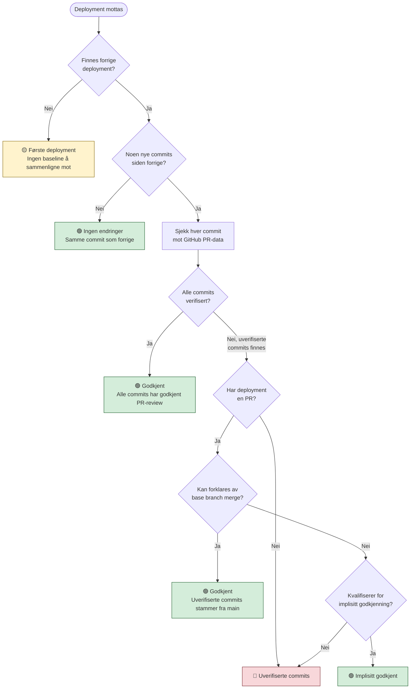

# Verifisering av fire-øyne-prinsippet

> **Målgruppe**: Utviklere, ledere og internrevisjon/kontrollere.
>
> **Formål**: Dokumentere hvordan Deployment Audit automatisk verifiserer at alle deployments til Nav sin Nais-plattform har hatt minst to personer involvert i kodeendringen (fire-øyne-prinsippet).

## Innholdsfortegnelse

- [Overordnet](#overordnet)
- [Beslutningsflyt](#beslutningsflyt)
- [Verifikasjonsresultater (statuser)](#verifikasjonsresultater-statuser)
- [Årsaker til manglende verifisering](#årsaker-til-manglende-verifisering)
- [PR-verifisering i detalj](#pr-verifisering-i-detalj)
- [Implisitt godkjenning](#implisitt-godkjenning)
- [Kodereferanser](#kodereferanser)
- [Ordliste](#ordliste)

---

## Overordnet

### Hva er fire-øyne-prinsippet?

Fire-øyne-prinsippet (four-eyes principle) betyr at minst **to personer** skal ha sett på en kodeendring før den settes i produksjon. I praksis betyr dette at:

1. Én person skriver koden
2. En annen person godkjenner koden (via en **pull request-review** på GitHub)

### Hva sjekker applikasjonen?

For hvert deployment sjekker systemet:

- Hvilke **commits** som er nye siden forrige deployment
- Om hver commit tilhører en **pull request** (PR) med godkjent review
- Om godkjenningen skjedde **etter siste commit** i PR-en (for å unngå at kode legges til etter godkjenning)
- Om den som godkjente er en **annen person** enn den som skrev koden

### Datakilder

| Kilde | Hva hentes | Når |
|-------|-----------|-----|
| **Nais API** | Deployments (app, tidspunkt, commit-SHA, miljø) | Periodisk hvert 5. minutt |
| **GitHub API** | Commits mellom deployments, PR-metadata, reviews, godkjenninger | Ved verifisering av hvert deployment |

### Prosessflyt på overordnet nivå

```
Nais API → Nye deployments oppdages → Lagres i database (status: "Venter")
                                            ↓
                                    GitHub API → Hent commits og PR-data
                                            ↓
                                    Verifiseringslogikk → Bestem status
                                            ↓
                                    Resultat lagres i database
```

---

## Beslutningsflyt

Når et deployment skal verifiseres, går systemet gjennom følgende beslutningstrinn:



### Steg-for-steg forklaring

#### Steg 1: Finnes forrige deployment?

Hvis dette er **første gang** applikasjonen deployes (ingen tidligere deployment i databasen), kan vi ikke vite hvilke commits som er nye. Deploymentet får status **`pending_baseline`** — det fungerer som referansepunkt for fremtidige deployments.

#### Steg 2: Er det noen nye commits?

Systemet henter listen over commits mellom forrige deployment sin commit-SHA og nåværende deployment sin commit-SHA via GitHub API. Hvis listen er tom (samme commit), betyr det at deploymentet er en **re-deploy** av eksakt samme kode. Status: **`no_changes`**.

#### Steg 3: Sjekk hver commit individuelt

For hver commit mellom forrige og nåværende deployment:

1. **Merge-commits** hoppes over (de er tekniske artefakter, ikke reelle kodeendringer)
2. **Commit i deployed PR**: Hvis commiten tilhører PR-en som ble deployet, sjekkes den PR-ens godkjenningsstatus
3. **Commit med egen PR**: Hvis commiten har en tilknyttet PR (f.eks. en squash-merge fra en annen branch), sjekkes den PR-ens godkjenningsstatus
4. **Commit uten PR**: Commiten er pushet direkte til main uten PR — dette er en **direkte push** og kan ikke verifiseres automatisk

#### Steg 4: Alle commits verifisert?

Hvis alle ikke-merge commits har en godkjent PR-review → status **`approved`**.

#### Steg 5: Base branch merge?

Noen ganger har en PR commits som ikke ble reviewet, men som stammer fra at utvikleren har merget `main` inn i sin feature-branch for å holde den oppdatert. Systemet sjekker:

- Finnes det en merge-commit som bringer `main` inn i feature-branchen?
- Er alle uverifiserte commits datert **før** denne merge-commiten?
- Har PR-en minst én godkjent review?

Hvis ja → status **`approved`** (med metode `base_merge`).

#### Steg 6: Implisitt godkjenning?

For visse typer PR-er kan selve **merge-handlingen** fungere som den andre personen sin godkjenning. Se [Implisitt godkjenning](#implisitt-godkjenning) for detaljer.

#### Steg 7: Uverifiserte commits

Hvis ingen av stegene over fører til godkjenning, forblir deploymentet **uverifisert**. Hver uverifisert commit får en spesifikk årsak (se [Årsaker til manglende verifisering](#årsaker-til-manglende-verifisering)).

---

## Verifikasjonsresultater (statuser)

Hvert deployment får én av følgende statuser etter verifisering:

| Status | Norsk navn | Godkjent? | Beskrivelse |
|--------|-----------|-----------|-------------|
| `approved` | Godkjent | ✅ Ja | Alle commits har godkjent PR-review |
| `implicitly_approved` | Implisitt godkjent | ✅ Ja | Godkjent via implisitte regler (f.eks. Dependabot) |
| `no_changes` | Ingen endringer | ✅ Ja | Ingen nye commits siden forrige deployment |
| `pending_baseline` | Første deployment | ⚠️ Nei | Første deployment — brukes som referansepunkt |
| `unverified_commits` | Uverifiserte commits | ❌ Nei | Én eller flere commits mangler godkjent PR-review |
| `manually_approved` | Manuelt godkjent | ✅ Ja | Manuelt godkjent av administrator i applikasjonen |
| `legacy` | Legacy | ⚠️ N/A | Deployment fra før audit-systemet ble aktivert |
| `error` | Feil | ❌ Nei | Teknisk feil under verifisering |

> **Koderef**: Enum `VerificationStatus` i [`app/lib/verification/types.ts`](../app/lib/verification/types.ts)

### Tilleggsstatuser i databasen

Databasekolonnen `four_eyes_status` har noen flere verdier som stammer fra eldre versjoner eller spesialtilfeller:

| Status | Beskrivelse |
|--------|-------------|
| `approved_pr` | Eldre alias for `approved` |
| `pending` / `pending_approval` | Venter på verifisering |
| `direct_push` | Direkte push uten PR (eldre klassifisering) |
| `approved_pr_with_unreviewed` | PR godkjent, men med uverifiserte commits fra main-merge |
| `repository_mismatch` | Repository matcher ikke forventet overvåket app |

> **Koderef**: Enum `FourEyesStatus` i [`app/lib/four-eyes-status.ts`](../app/lib/four-eyes-status.ts)

---

## Årsaker til manglende verifisering

Når en commit ikke kan verifiseres, tildeles en spesifikk årsak:

| Årsak | Norsk forklaring | Typisk scenario |
|-------|-----------------|-----------------|
| `no_pr` | Ingen PR funnet | Commit pushet direkte til `main` uten PR |
| `no_approved_reviews` | Ingen godkjent review | PR eksisterer, men ingen har trykket «Approve» |
| `approval_before_last_commit` | Godkjenning før siste commit | Noen godkjente PR-en, men så ble det pushet nye commits etterpå |
| `pr_not_approved` | PR ikke godkjent | Annen grunn til at PR-en mangler gyldig godkjenning |

> **Koderef**: Enum `UnverifiedReason` i [`app/lib/verification/types.ts`](../app/lib/verification/types.ts)

---

## PR-verifisering i detalj

### Hva sjekkes i en pull request?

Når systemet evaluerer om en PR har fire-øyne-godkjenning, sjekkes følgende:

1. **Finnes godkjente reviews?** — Minst én review med status `APPROVED`
2. **Er godkjenningen gitt etter siste reelle commit?** — En review gitt *før* siste commit er utdatert (noen kan ha lagt til kode etter godkjenning)
3. **Ignorering av base branch merge-commits** — Commits av typen `Merge branch 'main' into feature-x` regnes ikke som reelle kodeendringer

### Tidslinjekontroll

```
Commit A → Commit B → Review (APPROVED ✅) → Merge
                                ↑
                        Godkjenning etter siste commit = OK

Commit A → Review (APPROVED ✅) → Commit B → Merge
                                     ↑
                        Ny commit etter godkjenning = IKKE OK
```

### Unntaket: Merger som «andre øyne»

Hvis en PR har godkjente reviews, men godkjenningen var **før** siste commit, sjekkes det om **personen som merget PR-en** er en annen enn commit-forfatterne. Hvis ja, regnes merge-handlingen som validering — mergeren så den endelige tilstanden og valgte å merge.

> **Koderef**: Funksjon `verifyFourEyesFromPrData` i [`app/lib/verification/verify.ts`](../app/lib/verification/verify.ts)

### Base branch merge-deteksjon

Noen ganger oppstår uverifiserte commits fordi utvikleren har merget `main` inn i sin feature-branch. Disse commits ble allerede verifisert da de ble merget til `main` via sine egne PR-er. Systemet gjenkjenner dette mønsteret:

1. Finn merge-commiten (f.eks. `Merge branch 'main' into feature-x`)
2. Sjekk at alle uverifiserte commits er datert **før** merge-commiten
3. Sjekk at PR-en har minst én godkjent review

Hvis alle tre kriterier er oppfylt → deploymentet godkjennes med metode `base_merge`.

> **Koderef**: Funksjoner `isBaseBranchMergeCommit` og `shouldApproveWithBaseMerge` i [`app/lib/verification/verify.ts`](../app/lib/verification/verify.ts)

---

## Implisitt godkjenning

Implisitt godkjenning er en konfigurerbar mekanisme som lar visse typer deployments bli godkjent uten eksplisitt PR-review. Innstillingen konfigureres per overvåket applikasjon.

### Moduser

| Modus | Norsk navn | Regel |
|-------|-----------|-------|
| `off` | Av | Ingen implisitt godkjenning. Krever alltid eksplisitt review. |
| `dependabot_only` | Kun Dependabot | Godkjenner PR-er opprettet av Dependabot med kun Dependabot-commits, **forutsatt** at en annen person merget PR-en. |
| `all` | Alle PR-er | Godkjenner PR-er der personen som merget er **forskjellig fra** PR-forfatteren og siste commit-forfatter. Merge-handlingen fungerer da som «andre øyne». |

### Eksempler

**Dependabot-modus** (`dependabot_only`):
- ✅ Dependabot oppretter PR → Dependabot committer → Utvikler merget → Implisitt godkjent
- ❌ Dependabot oppretter PR → Utvikler legger til commit → Utvikler merget → Ikke godkjent (manuell commit)

**Alle-modus** (`all`):
- ✅ Utvikler A oppretter PR → Utvikler A committer → Utvikler B merger → Implisitt godkjent
- ❌ Utvikler A oppretter PR → Utvikler A committer → Utvikler A merger → Ikke godkjent (samme person)

> **Koderef**: Funksjon `checkImplicitApproval` i [`app/lib/verification/verify.ts`](../app/lib/verification/verify.ts),
> enum `ImplicitApprovalMode` i [`app/lib/verification/types.ts`](../app/lib/verification/types.ts)

---

## Kodereferanser

### Verifiseringslogikk (ren, uten sideeffekter)

| Fil | Ansvar | Sentrale funksjoner |
|-----|--------|-------------------|
| [`app/lib/verification/verify.ts`](../app/lib/verification/verify.ts) | Beslutningslogikk for fire-øyne-verifisering | `verifyDeployment`, `verifyFourEyesFromPrData`, `shouldApproveWithBaseMerge`, `checkImplicitApproval` |
| [`app/lib/verification/types.ts`](../app/lib/verification/types.ts) | Typer, enumer og labels | `VerificationStatus`, `UnverifiedReason`, `ImplicitApprovalMode`, `VerificationInput`, `VerificationResult` |

### Orkestrering (henting, lagring, kjøring)

| Fil | Ansvar | Sentrale funksjoner |
|-----|--------|-------------------|
| [`app/lib/verification/index.ts`](../app/lib/verification/index.ts) | Komplett verifiseringsflyt (hent → verifiser → lagre) | `runVerification`, `reverifyDeployment`, `runDebugVerification` |
| [`app/lib/verification/fetch-data.server.ts`](../app/lib/verification/fetch-data.server.ts) | Henter data fra GitHub/cache | `fetchVerificationData`, `fetchVerificationDataForAllDeployments` |
| [`app/lib/verification/store-data.server.ts`](../app/lib/verification/store-data.server.ts) | Lagrer resultat til database | `storeVerificationResult` |

### Periodisk synkronisering

| Fil | Ansvar | Sentrale funksjoner |
|-----|--------|-------------------|
| [`app/lib/sync/scheduler.server.ts`](../app/lib/sync/scheduler.server.ts) | Periodisk kjøring av alle jobber | `startPeriodicSync`, `runPeriodicSync` |
| [`app/lib/sync/github-verify.server.ts`](../app/lib/sync/github-verify.server.ts) | Batch-verifisering av deployments | `verifyDeploymentsFourEyes`, `verifySingleDeployment` |
| [`app/lib/sync/nais-sync.server.ts`](../app/lib/sync/nais-sync.server.ts) | Henter deployments fra Nais API | `syncNewDeploymentsFromNais` |

### Statuser og kategorisering

| Fil | Ansvar | Sentrale funksjoner |
|-----|--------|-------------------|
| [`app/lib/four-eyes-status.ts`](../app/lib/four-eyes-status.ts) | Database-statuser med labels og kategorisering | `FourEyesStatus`, `isApprovedStatus`, `isNotApprovedStatus` |

### Tester

| Fil | Dekker |
|-----|--------|
| [`app/lib/__tests__/four-eyes-verification.test.ts`](../app/lib/__tests__/four-eyes-verification.test.ts) | PR-review, squash merge, Dependabot-scenarier |
| [`app/lib/__tests__/verify-coverage-gaps.test.ts`](../app/lib/__tests__/verify-coverage-gaps.test.ts) | Alle 7 beslutningssteg i `verifyDeployment` |
| [`app/lib/__tests__/v1-unverified-reasons.test.ts`](../app/lib/__tests__/v1-unverified-reasons.test.ts) | Komplekse multi-commit scenarier |

---

## Ordliste

| Begrep | Forklaring |
|--------|-----------|
| **Fire-øyne-prinsippet** | Prinsippet om at minst to personer skal ha sett på en kodeendring |
| **Deployment** | En utrulling av kode til et kjøremiljø (f.eks. produksjon) |
| **Commit** | En enkelt kodeendring i Git-historikken |
| **Pull request (PR)** | En forespørsel om å flette kodeendringer inn i hovedbranchen |
| **Review** | En gjennomgang og vurdering av kodeendringer i en PR |
| **Approve** | Å godkjenne en PR etter review |
| **Merge** | Å flette kodeendringer fra en PR inn i hovedbranchen |
| **Merge-commit** | En teknisk commit som oppstår ved sammenfletting av brancher |
| **Base branch** | Hovedbranchen (typisk `main`) som PR-er merges inn i |
| **Squash merge** | En merge-strategi der alle commits i en PR komprimeres til én commit |
| **Dependabot** | GitHubs automatiske bot for oppdatering av avhengigheter |
| **Nais** | Nav sin applikasjonsplattform basert på Kubernetes |
| **SHA** | Unik identifikator (hash) for en commit |
| **Snapshot** | Lagret kopi av GitHub-data i databasen for caching og sporbarhet |
| **Implisitt godkjenning** | Automatisk godkjenning basert på regler (f.eks. at merger er en annen person enn forfatter) |
