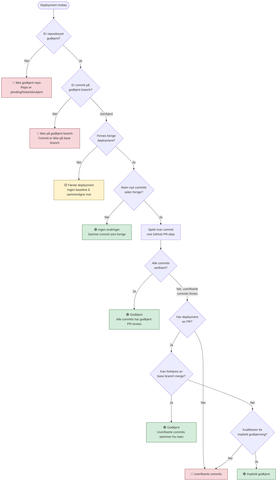

# Verifisering av fire-øyne-prinsippet

> **Målgruppe**: Utviklere, ledere og internrevisjon/kontrollere.
>
> **Formål**: Dokumentere hvordan Deployment Audit automatisk verifiserer at alle deployments til Nav sin Nais-plattform har hatt minst to personer involvert i kodeendringen (fire-øyne-prinsippet).

## Innholdsfortegnelse

- [Overordnet](#overordnet)
- [Beslutningsflyt](#beslutningsflyt)
- [Verifikasjonsresultater (statuser)](#verifikasjonsresultater-statuser)
- [Årsaker til manglende verifisering](#årsaker-til-manglende-verifisering)
- [PR-verifisering i detalj](#pr-verifisering-i-detalj)
- [Implisitt godkjenning](#implisitt-godkjenning)
- [Kodereferanser](#kodereferanser)
- [Ordliste](#ordliste)

---

## Overordnet

### Hva er fire-øyne-prinsippet?

Fire-øyne-prinsippet (four-eyes principle) betyr at minst **to personer** skal ha sett på en kodeendring før den settes i produksjon. I praksis betyr dette at:

1. Én person skriver koden
2. En annen person godkjenner koden (via en **pull request-review** på GitHub)

### Hva sjekker applikasjonen?

For hvert deployment sjekker systemet:

- Hvilke **commits** som er nye siden forrige deployment
- Om hver commit tilhører en **pull request** (PR) med godkjent review
- Om godkjenningen skjedde **etter siste commit** i PR-en (for å unngå at kode legges til etter godkjenning)
- Om den som godkjente er en **annen person** enn den som skrev koden

### Datakilder

| Kilde | Hva hentes | Når |
|-------|-----------|-----|
| **Nais API** | Deployments (app, tidspunkt, commit-SHA, miljø) | Periodisk hvert 5. minutt |
| **GitHub API** | Commits mellom deployments, PR-metadata, reviews, godkjenninger, check runs | Ved verifisering av hvert deployment |
| **GitHub API (repo metadata)** | `default_branch` for hver overvåket app | Periodisk, maks én gang per app per 24 timer |

#### Auto-deteksjon av default_branch

`monitored_applications.default_branch` brukes til å filtrere PR-er ved verifisering — kun PR-er med `base.ref` som matcher denne verdien telles. For å unngå feilkonfigurasjon (f.eks. konfigurert `main` mens repoet faktisk bruker `master`) hentes feltet fra GitHub som del av synkroniseringssyklusen, med 24t cooldown per app. Når **deployment-commiten selv** ikke har en tilknyttet PR mot konfigurert default-branch, og GitHub i stedet returnerer en PR mot en annen branch, vises en advarsel («Mulig feil-konfigurert default-branch») på deployment-detaljsiden inntil neste sync har korrigert verdien. Advarselen vises kun basert på deployment-commitens PR — ikke basert på enkeltcommits i rekken mellom to deployments. Dette er fordi commits legitimt kan ha gått gjennom en testbranch (f.eks. sandbox) på vei til main uten at appens konfigurasjon er feil.

#### Prinsipp: GitHub er eneste autoritative kilde ved verifisering

`monitored_applications.default_branch` og andre DB-cachede verdier kan være foreldet — f.eks. om et repo har omdøpt default-branchen etter sist synkronisering. **Branch-relaterte data som lagres på et deployment (f.eks. `branch_name`) må alltid hentes direkte fra GitHub ved verifiseringstidspunktet**, ikke utledes fra cachede DB-verdier.

I praksis betyr dette:
- `detectedBranchName` hentes fra `deployedPr.metadata.headBranch` (GitHub PR API) eller `getBranchFromWorkflowRun()` (GitHub Actions API) — begge direkte fra GitHub ved verifisering
- `baseBranch` fra DB skal **ikke** brukes som kilde for `branch_name`, selv om `commitOnBaseBranch === true`, fordi verdien kan reflektere en annen branch enn den som faktisk var default på deployment-tidspunktet

### Prosessflyt på overordnet nivå

```
Nais API → Nye deployments oppdages → Lagres i database (status: "Venter")
                                            ↓
                                    GitHub API → Hent commits og PR-data
                                            ↓
                                    Verifiseringslogikk → Bestem status
                                            ↓
                                    Resultat lagres i database
```

---

## Beslutningsflyt

Når et deployment skal verifiseres, går systemet gjennom følgende beslutningstrinn:


```mermaid
flowchart TD
    Start([Deployment mottas]) --> C0{Er repositoryet\ngodkjent?}

    C0 -- Nei --> R0[🔴 Ikke godkjent repo\nRepo er pending/historisk/ukjent]

    C0 -- Ja --> C0b{Er commit på\ngodkjent branch?}

    C0b -- Nei --> R0b[🔴 Ikke på godkjent branch\nCommit er ikke på base branch]
    C0b -- Ja/Ukjent --> C1{Finnes forrige\ndeployment?}

    C1 -- Nei --> R1[🟡 Første deployment\nIngen baseline å sammenligne mot]

    C1 -- Ja --> C2{Noen nye commits\nsiden forrige?}

    C2 -- Nei --> R2[🟢 Ingen endringer\nSamme commit som forrige]

    C2 -- Ja --> C3[Sjekk hver commit\nmot GitHub PR-data]

    C3 --> C4{Alle commits\nverifisert?}

    C4 -- Ja --> R3[🟢 Godkjent\nAlle commits har godkjent PR-review]

    C4 -- Nei, uverifiserte\ncommits finnes --> C5{Har deployment\nen PR?}

    C5 -- Nei --> R7[🔴 Uverifiserte commits]

    C5 -- Ja --> C6{Kan forklares av\nbase branch merge?}

    C6 -- Ja --> R4[🟢 Godkjent\nUverifiserte commits stammer fra main]

    C6 -- Nei --> C7{Kvalifiserer for\nimplisitt godkjenning?}

    C7 -- Ja --> R5[🟢 Implisitt godkjent]

    C7 -- Nei --> R7[🔴 Uverifiserte commits]

    style R0 fill:#f8d7da,stroke:#721c24
    style R0b fill:#f8d7da,stroke:#721c24
    style R1 fill:#fff3cd,stroke:#856404
    style R2 fill:#d4edda,stroke:#155724
    style R3 fill:#d4edda,stroke:#155724
    style R4 fill:#d4edda,stroke:#155724
    style R5 fill:#d4edda,stroke:#155724
    style R7 fill:#f8d7da,stroke:#721c24
```

### Steg-for-steg forklaring

#### Steg 0: Er repositoryet godkjent?

Før noen annen verifisering sjekkes om deploymentets repository er registrert og godkjent (`active`) for applikasjonen. Hvis repositoryet har status `pending_approval`, `historical`, eller ikke er registrert i det hele tatt (`unknown`), avvises verifiseringen umiddelbart med status **`unauthorized_repository`**. Dette forhindrer at deployments fra uautoriserte kilder kan bli markert som godkjent.

> 📁 Se `handleUnauthorizedRepository` i [`verify.ts`](../app/lib/verification/verify.ts) og `findRepositoryForApp` i [`application-repositories.server.ts`](../app/db/application-repositories.server.ts)

#### Steg 0b: Er commit på godkjent branch?

Systemet bruker GitHub Compare API til å sjekke om den deployede commit-SHAen befinner seg på applikasjonens konfigurerte base-branch (f.eks. `main`). Hvis committen **ikke** er på base-branchen, betyr det at noen har deployet fra en feature-branch eller annen uautorisert branch. Status: **`unauthorized_branch`**.

Hvis API-kallet feiler (f.eks. midlertidig nettverksproblem), fortsetter verifiseringen normalt (**fail-open**) — det er bedre å sjekke fire-øyne enn å blokkere alt.

> 📁 Se `handleUnauthorizedBranch` i [`verify.ts`](../app/lib/verification/verify.ts) og `isCommitOnBranch` i [`github.server.ts`](../app/lib/github.server.ts)

#### Steg 1: Finnes forrige deployment?

Hvis dette er **første gang** applikasjonen deployes (ingen tidligere deployment i databasen), kan vi ikke vite hvilke commits som er nye. Deploymentet får status **`pending_baseline`** — det fungerer som referansepunkt for fremtidige deployments.

> **Merk:** Legacy-deployments (importert historikk med ugyldige commit-referanser som `refs/heads/...`) filtreres bort ved søk etter forrige deployment. Første deployment etter legacy-perioden behandles derfor som `pending_baseline`.
>
> Tilsvarende filtreres deployments som ligger før appens `audit_start_year` bort. Første deployment innenfor revisjonsperioden behandles som `pending_baseline` selv om det finnes eldre pre-revisjons-deployments. Dette gjelder både live verifisering og pre-beregningen av verifiseringsavvik (`compute-diffs`).

**Repo-basert forrige-leveranse (monorepo-støtte):** Forrige deployment finnes ved å søke på tvers av **alle** applikasjoner som deler samme GitHub-repo (identifisert med det stabile `github_repo_id`, ikke `(owner, repo)`-strengen), uavhengig av hvilket miljø de kjører i og uavhengig av `monitored_app_id`. Dette dekker både det vanlige tilfellet (ett repo → én app) og monorepo-tilfellet (flere apper produksjonssettes uavhengig fra samme repo) med samme spørring — en «vanlig» app er i denne modellen bare et monorepo med én applikasjon.

Siden NDA kun følger opp applikasjoner i produksjon, gjøres **ikke** noe skille mellom miljøer (f.eks. `prod-fss` og `prod-gcp`) i dette søket.

**Delt `audit_start_year` for hele repoet:** Siden `audit_start_year` filtrerer forrige-leveranse-søket (se over) og alle apper i samme (mono)repo deler samme spørring, må de også ha samme `audit_start_year` for at søket skal gi korrekt resultat. Dette er nå normalisert i databasen: tabellen `repositories` (nøklet på `github_repo_id`) er kilden til sannhet for `audit_start_year`, `implicit_approval_mode` og `default_branch`. Alle apper som deler samme `github_repo_id` leser dermed de samme verdiene, og et monorepo kan ikke lenger få ulike regler per app.

**Effektive verdier og fallback:** Verifiseringen bruker *effektive* innstillinger, ikke kolonnene på `monitored_applications` direkte. Fallback-regelen er ulik per felt:

| Felt | Kilde når repoet er koblet (`repositories`-rad finnes) | Kilde når repoet ikke er koblet ennå |
|------|--------------------------------------------------------|----------------------------------------|
| `audit_start_year` | `repositories.audit_start_year` alltid — også når den er `NULL` (betyr «ingen nedre grense» for hele repoet, ikke «ufastsatt») | `null` (ingen fallback — uten kjent repository finnes ingen kode å revidere) |
| `implicit_approval_mode` | `repositories.implicit_approval_mode` (aldri NULL) | `'off'` (ingen fallback — implisitt godkjenning krever et kjent repository) |
| `default_branch` | `repositories.default_branch`, med fallback til `monitored_applications.default_branch` hvis NULL | `monitored_applications.default_branch` |

`audit_start_year` og `implicit_approval_mode` faller **ikke** tilbake til app-nivå-kilder i det hele tatt lenger — verken når repoet er koblet (der ville det undergravd garantien om at alle apper i repoet vurderes med identiske regler) eller når repoet mangler (uten kjent repository er det ikke noe kode å revidere eller godkjenne, så innstillingene kan heller ikke settes på app-nivå). Admin-UI for disse feltene viser en informasjonsboks i stedet for skjemaet når appen ikke har en koblet repository. `default_branch` faller derimot fortsatt tilbake per app, fordi NULL der kun betyr «ikke synket fra GitHub ennå», ikke et bevisst valg, og fordi `application_repositories.github_repo_id` fylles asynkront.

Endringer gjøres via `updateRepositorySettings` i [`repositories.server.ts`](../app/db/repositories.server.ts): den oppdaterer `repositories`, logger til `repo_config_audit_log`, og kjører baseline-rekalkulering (`pending_baseline`/`baseline`) for hele repo-scopet når `audit_start_year` endres. Alle apper som deler samme `github_repo_id` henter *effektive* innstillinger via `getEffectiveSettingsForApp(s)` — det finnes ingen separat per-app-kopi av `audit_start_year`/`implicit_approval_mode` å speile ned til lenger (kun `default_branch` har fortsatt en per-app-fallback, se tabellen over). **Selve beslutningsalgoritmen i `verify.ts` er uendret** — kun kilden til `auditStartYear` og `implicitApprovalSettings` er flyttet.

Fase 0s `audit_year_mismatch`-varsel er dermed en ren informasjons-/oppdagelsesmekanisme for apper som ennå ikke er koblet til en `repositories`-rad.

> 📁 Se `getEffectiveSettingsForApp` og `updateRepositorySettings` i [`repositories.server.ts`](../app/db/repositories.server.ts), SQL-fragmentene i [`repository-settings-sql.ts`](../app/db/repository-settings-sql.ts), `applyAuditStartYearChangeForApps` i [`audit-start-year-baseline.server.ts`](../app/db/audit-start-year-baseline.server.ts), og `canAccessRepositorySettingsAdmin` i [`authorization.server.ts`](../app/lib/authorization.server.ts) (autorisasjonssjekken kaskaderer på samme måte, slik at en admin må ha tilgang til *alle* apper i repoet for å kunne endre repo-nivå-innstillingene).

Kandidatene sorteres etter tidsstempel (nyeste først). Hver kandidat bekreftes med en **ancestry-sjekk** mot GitHub (`compareCommits`) før den godtas som forrige leveranse — kandidaten må faktisk ligge bakover i commit-historien til den nåværende deploymentens commit (`status = 'identical'` eller `'ahead'`). Dette gjelder også når søket returnerer **kun én** kandidat (regnes fortsatt som ett billig `compareCommits`-kall), slik at en enkelt kandidat som ikke lenger er en forfar (f.eks. etter force-push eller historie-omskriving) ikke feilaktig godtas. Hvis søket returnerer **flere** kandidater (typisk i et monorepo hvor flere apper har deployert på ulike tidspunkt), går systemet fra nyeste til eldste kandidat til en bekreftet forfar er funnet.

Hvis en kandidat viser `status = 'diverged'` (commiten er **ikke** en forfar — typisk tegn på force-push, som ikke støttes i NDA, eller en direkte deploy fra en ikke-merget gren), ekskluderes kandidaten fra søket og hendelsen logges strukturert som `history_anomaly` for overvåking. Søket fortsetter til neste eldre kandidat i stedet for å stoppe helt. Hvis ingen kandidat kan bekreftes som forfar, får deploymentet status **`pending_baseline`** i stedet for å falle tilbake på nyeste-etter-tid.

> 📁 Se `getPreviousDeployment` i [`previous-deployment.server.ts`](../app/lib/verification/fetch-data/previous-deployment.server.ts) og `getCommitAncestryStatus` i [`git.server.ts`](../app/lib/github/git.server.ts)

#### Steg 2: Er det noen nye commits?

Systemet henter listen over commits mellom forrige deployment sin commit-SHA og nåværende deployment sin commit-SHA via GitHub API.

> **Viktig:** `no_changes` betyr kun at det ikke finnes nye commits å diffe mot forrige deployment — det er **ikke** i seg selv en godkjenning. Hvis PR-en som ble deployet (`deployedPr`) er tilgjengelig, kjører systemet likevel den vanlige four-eyes-sjekken mot den før status settes. Er PR-en ikke four-eyes-godkjent (f.eks. selvgodkjenning), returneres status **`unverified_commits`** med `hasFourEyes: false` i stedet for å arve en eventuell tidligere (feilaktig) godkjent status. Dette hindrer at en re-deploy av en commit som opprinnelig ble feilverifisert, fortsetter å vises som godkjent for alltid. Hvis `deployedPr` derimot **ikke** er tilgjengelig (f.eks. direkte push uten PR, eller PR-oppslaget feilet), kan denne re-sjekken ikke utføres, og deploymentet beholder status `no_changes` med `hasFourEyes: true` som før.

##### Samme commit-SHA (re-deploy)
- Deploymentet er en **re-deploy** av eksakt samme kode. Status: **`no_changes`**.

##### Samme commit-SHA men GitHub compare returnerer 'identical'
- Hvis GitHub compare-API returnerer `status = 'identical'`, bekrefter det at begge commitene er identiske. Status: **`no_changes`**.

##### Forskjellig commit-SHA — no-diff-deteksjon

Når GitHub compare returnerer 0 commits til tross for ulike SHAer, bruker systemet **compare-metadata** og en **tree-comparison-fallback** for å skille ekte «ingen diff» fra rollback, branch-divergens og API-feil:

**Steg 1: Tree-comparison-fallback (for ambigøse tilfeller)**
- Hvis begge commits har **identiske commit trees** (`tree.sha` match) → **Ekte no-diff** ✓
  - Eksempel: To brancher som ble opprettet fra samme commit, deretter rebased eller reordered, men som nå peker på kode med samme tree
- Hvis **tree-sjekken finner ulik trees** eller **feiler** → Fortsett til steg 2

**Steg 2: Sjekk nærliggende godkjente deployments (for rollback-scenario)**

Hvis ingen av stegene over bekreftet no-diff:
1. **Nærliggende deployment med samme commit-SHA** (±30 min, samme applikasjon) som allerede er godkjent → behandles som retry/duplikat, status: **`no_changes`**.
2. **Nærliggende deployment med annen commit-SHA** (±30 min, samme applikasjon) som er godkjent → mulig *superseded deploy* (heuristikk, ikke ancestry-verifisert), status: **`no_changes`**. Typisk ved rapid-fire deploys der webhook-rekkefølge ikke matcher merge-rekkefølge.
3. Ingen nærliggende godkjent deployment → Status: **`error`**. Krever manuell vurdering.

> «Nærliggende deployment» er alltid begrenset til **samme `monitored_app_id`** — apper som deler samme GitHub-repo og miljø (f.eks. flere apper bygget fra samme monorepo), men som ikke er eksplisitt koblet sammen i en applikasjonsgruppe, kan ikke referere til hverandres deploymentrekke.

**Når returneres error?**
- `compareFailed = true` → GitHub compare API feilet (403 Forbidden, 404 Not Found, 500, osv.). Status: **`error`** — GitHub App må sjekkes.
- Ulike SHAer, 0 commits, og `noDiffDetected = false` → Trolig rollback eller branch-divergens med faktisk kodeendringer. Status: **`error`** — krever manuell vurdering.

#### Steg 3: Sjekk hver commit individuelt

For hver commit mellom forrige og nåværende deployment:

1. **Base-branch merge-commits** hoppes over (`Merge branch 'main' into ...`) — disse bringer allerede verifisert kode inn i feature-branchen
2. **Andre merge-commits** (f.eks. `Merge branch unapproved-feature`) verifiseres som vanlige commits — de kan inneholde kodeendringer fra konfliktløsning
3. **Commit i deployed PR**: Hvis commiten tilhører PR-en som ble deployet, sjekkes den PR-ens godkjenningsstatus
4. **Commit med egen PR**: Hvis commiten har en tilknyttet PR (f.eks. en squash-merge fra en annen branch), sjekkes den PR-ens godkjenningsstatus
5. **Commit dekket av merge-commit-PR**: GitHub's commit→PR API returnerer ikke alltid alle PR-er for en gitt SHA — typisk skjer dette når en commit var på en testbranch (f.eks. sandbox) og ble merget til main via en annen PR. Hvis commiten inngår i commit-listen til en PR-merge-commit som finnes i samme deployment-rekke, verifiseres den via den PR-ens godkjenningsstatus.
6. **Commit uten PR**: Commiten er pushet direkte til main uten PR — dette er en **direkte push** og kan ikke verifiseres automatisk

#### Steg 4: Alle commits verifisert?

Hvis alle ikke-merge commits har en godkjent PR-review → status **`approved`**.

#### Steg 5: Base branch merge?

Noen ganger har en PR commits som ikke ble reviewet, men som stammer fra at utvikleren har merget `main` inn i sin feature-branch for å holde den oppdatert. Systemet sjekker:

- Finnes det en merge-commit som bringer `main` inn i feature-branchen?
- Er alle uverifiserte commits datert **før** denne merge-commiten?
- Har PR-en minst én godkjent review?

Hvis ja → status **`approved`** (med metode `base_merge`).

#### Steg 6: Implisitt godkjenning?

For visse typer PR-er kan selve **merge-handlingen** fungere som den andre personen sin godkjenning. Se [Implisitt godkjenning](#implisitt-godkjenning) for detaljer.

#### Steg 7: Uverifiserte commits

Hvis ingen av stegene over fører til godkjenning, forblir deploymentet **uverifisert**. Hver uverifisert commit får en spesifikk årsak (se [Årsaker til manglende verifisering](#årsaker-til-manglende-verifisering)).

---

## Verifikasjonsresultater (statuser)

Hvert deployment får én av følgende statuser etter verifisering:

| Status | Norsk navn | Godkjent? | Beskrivelse |
|--------|-----------|-----------|-------------|
| `approved` | Godkjent | ✅ Ja | Alle commits har godkjent PR-review |
| `implicitly_approved` | Implisitt godkjent | ✅ Ja | Godkjent via implisitte regler (f.eks. Dependabot) |
| `no_changes` | Ingen endringer | ✅ Ja | Re-deploy av eksakt samme commit, eller compare/tree bekrefter at det ikke finnes kodeendringer. Hvis en tilgjengelig `deployedPr` viser at PR-en ikke er four-eyes-godkjent, returneres i stedet `unverified_commits` |
| `pending_baseline` | Første deployment | ⚠️ Nei | Første deployment — brukes som referansepunkt |
| `unverified_commits` | Uverifiserte commits | ❌ Nei | Én eller flere commits mangler godkjent PR-review |
| `unauthorized_repository` | Ikke godkjent repo | ❌ Nei | Deploymentets repo er ikke godkjent for applikasjonen |
| `unauthorized_branch` | Ikke på godkjent branch | ❌ Nei | Deployet commit er ikke på konfigurert base-branch |
| `manually_approved` | Manuelt godkjent | ✅ Ja | Manuelt godkjent av administrator i applikasjonen |
| `legacy` | Legacy | ⚠️ N/A | Deployment fra før audit-systemet ble aktivert |
| `error` | Feil | ❌ Nei | Teknisk feil under verifisering, eller tvetydig compare med ulike commit-SHAer og reell diff/branch-divergens |

> **Koderef**: Enum `VerificationStatus` i [`app/lib/verification/types.ts`](../app/lib/verification/types.ts)

### Tilleggsstatuser i databasen

Databasekolonnen `four_eyes_status` har noen flere verdier som stammer fra eldre versjoner eller spesialtilfeller:

| Status | Beskrivelse |
|--------|-------------|
| `approved_pr` | Eldre alias for `approved` |
| `pending` / `pending_approval` | Venter på verifisering |
| `direct_push` | Direkte push uten PR (eldre klassifisering) |
| `approved_pr_with_unreviewed` | PR godkjent, men med uverifiserte commits fra main-merge |
| `repository_mismatch` | Repository matcher ikke forventet overvåket app |

> **Koderef**: Enum `FourEyesStatus` i [`app/lib/four-eyes-status.ts`](../app/lib/four-eyes-status.ts)

---

## Årsaker til manglende verifisering

Når en commit ikke kan verifiseres, tildeles en spesifikk årsak:

| Årsak | Norsk forklaring | Typisk scenario |
|-------|-----------------|-----------------|
| `no_pr` | Ingen PR funnet | Commit pushet direkte til `main` uten PR |
| `no_approved_reviews` | Ingen godkjent review | PR eksisterer, men ingen har trykket «Approve» |
| `approval_before_last_commit` | Godkjenning før siste commit | Noen andre godkjente PR-en, men så ble det pushet nye commits etterpå |
| `self_approval` | Selvgodkjenning | Godkjenningen kom fra samme person som skrev siste commit i PR-en — teller aldri som fire-øyne, uansett tidspunkt |
| `pr_not_approved` | PR ikke godkjent | Annen grunn til at PR-en mangler gyldig godkjenning |
| `unlinked_commit_author` | Siste commit har ukjent forfatter-identitet | Siste commit er ikke koblet til en verifisert GitHub-konto (f.eks. e-post som ikke er registrert på kontoen), så identiteten kan ikke sammenlignes trygt mot reviewer/merger |

> **Koderef**: Enum `UnverifiedReason` i [`app/lib/verification/types.ts`](../app/lib/verification/types.ts)

---

## PR-verifisering i detalj

### Hva sjekkes i en pull request?

Når systemet evaluerer om en PR har fire-øyne-godkjenning, sjekkes følgende:

1. **Finnes godkjente reviews?** — Minst én review med status `APPROVED`
2. **Er godkjenningen gitt etter siste reelle commit — av en annen person enn den som skrev commiten?** — Systemet sammenligner reviewets `commit_id` (SHA-en GitHub registrerer at revieweren faktisk så) mot posisjonen til siste reelle commit i PR-en. Dette er en strukturell sjekk basert på git-historikk, ikke klokkeslett, og lar seg derfor ikke omgå ved å manipulere `git commit --date`. Hvis `commit_id` mangler, faller systemet tilbake til en dato-sammenligning som bruker **den seneste av `authorDate` og `committerDate`** — `committerDate` er git-objektets committer-tidsstempel, som for commits GitHub selv lager (web-redigering, API, squash/rebase-merge) settes serverside, men for vanlige pushede commits kan settes fritt av klienten (`GIT_COMMITTER_DATE`). Reserveløsningen gir dermed forsvar mot at kun `authorDate` manipuleres, ikke en absolutt garanti. En godkjenning fra **samme person som skrev siste commit** (selvgodkjenning) teller **ikke**, uansett tidspunkt, og gir status `self_approval` (ikke `approval_before_last_commit`) — se [Unntaket: Merger som «andre øyne»](#unntaket-merger-som-andre-øyne) for hvordan slike tilfeller *eventuelt* kan godkjennes via mergeren, forutsatt at implisitt godkjenning er aktivert
3. **Er siste commits forfatter koblet til en ekte GitHub-konto?** — Hvis GitHub ikke klarer å koble commiten til en verifisert konto (f.eks. fordi commit-e-posten ikke er registrert), kan ikke identiteten sammenlignes trygt mot reviewer/merger. Slike commits gir status `unlinked_commit_author` i stedet for å falle tilbake til et upålitelig fritekstnavn
4. **Ignorering av base branch merge-commits** — Commits av typen `Merge branch 'main' into feature-x` regnes ikke som reelle kodeendringer, **forutsatt at commiten faktisk har minst to foreldre** (ekte git-merge). En vanlig enkeltcommit med tilsvarende commit-melding, men bare én forelder, regnes ikke som merge-commit og blir vurdert på vanlig måte — dette hindrer at noen kan «forkle» en kodeendring som en harmløs merge ved å gi den riktig commit-melding

### Tidslinjekontroll

```
Commit A → Commit B (dev-1) → Review (APPROVED ✅, dev-2) → Merge
                                          ↑
                        Godkjenning etter siste commit, av annen person = OK

Commit A → Commit B (dev-1) → Review (APPROVED ✅, dev-1) → Merge
                                          ↑
                        Selvgodkjenning etter siste commit = IKKE OK

Commit A → Review (APPROVED ✅, dev-2) → Commit B → Merge
                                              ↑
                        Ny commit etter godkjenning = IKKE OK (godkjenningen er utdatert,
                        uansett hvem som skrev commit B)

Commit A → Review (APPROVED ✅, dev-2) → Commit B (dev-2) → Merge (dev-2)
                                              ↑
                        Reviewer pusher selv en commit etter egen godkjenning, og merger
                        selv — utnytter at GitHub ikke nødvendigvis invaliderer gamle
                        godkjenninger ved nye commits = IKKE OK
```

### Unntaket: Merger som «andre øyne»

Hvis en PR har godkjente reviews, men godkjenningen enten var **før** siste commit (`approval_before_last_commit`), eller var en **selvgodkjenning** (`self_approval` — samme person som skrev siste commit, uansett tidspunkt), sjekkes det om mergeren likevel kan regnes som «andre øyne» — betinget av hvilken implisitt godkjenning-modus repoet har:

- **`off`**: Unntaket gjelder aldri. Godkjenningen fører til status `approval_before_last_commit` eller `self_approval` (avhengig av hvilken av de to situasjonene som forelå), uansett hvem som merger.
- **`dependabot_only`**: Unntaket gjelder kun for PR-er opprettet av Dependabot der **alle** commits er skrevet av Dependabot, og mergeren er en annen bruker enn Dependabot selv. Samme betingelser som den generelle implisitte godkjenningen i `dependabot_only`-modus.
- **`all`**: Unntaket gjelder når mergeren verken er PR-forfatteren eller forfatteren av siste (reelle) commit.

Grunnen til at dette kobles til implisitt godkjenning-innstillingen, er at unntaket i praksis *er* en form for implisitt godkjenning: en (mulig forfalsket eller foreldet) godkjenning kombinert med at noen trykker merge, uten at noen nødvendigvis har sett den endelige diffen. Merk at `dependabot_only` **ikke** gir et generelt merger-unntak for menneske-PR-er — kun for rene Dependabot-PR-er, konsistent med hva innstillingen faktisk lover.

> **Koderef**: Funksjon `verifyFourEyesFromPrData` i [`app/lib/verification/verify.ts`](../app/lib/verification/verify.ts) — parameteren `implicitApprovalMode` styrer dette, med samme betingelser som `checkImplicitApproval`. Denne sjekken kjøres konsistent for **alle** commit-verifiseringsstier i `findUnverifiedCommits` — den deployede PR-en, PR-en tilknyttet enkeltcommits (`commit.pr`), og PR-en som dekker en merge-commit (`coveringPr`) — slik at merger-unntaket ikke bare gjelder for hoveddeploymentets egen PR, men også for andre PR-er som inngår i et sett med commits mellom to deployments.

### Base branch merge-deteksjon

Noen ganger oppstår uverifiserte commits fordi utvikleren har merget `main` inn i sin feature-branch. Disse commits ble allerede verifisert da de ble merget til `main` via sine egne PR-er. Systemet gjenkjenner dette mønsteret:

1. Finn merge-commiten (f.eks. `Merge branch 'main' into feature-x`) — **krever at commiten faktisk har minst to foreldre** i git-historikken, ikke bare en commit-melding som ser slik ut
2. Sjekk at alle uverifiserte commits er datert **før** merge-commiten
3. Sjekk at PR-en har minst én godkjent review

Hvis alle tre kriterier er oppfylt → deploymentet godkjennes med metode `base_merge`.

> **Koderef**: Funksjoner `isBaseBranchMergeCommit` og `shouldApproveWithBaseMerge` i [`app/lib/verification/implicit-approval.ts`](../app/lib/verification/implicit-approval.ts)

### Datalagring og rådataarkiv for GitHub-data

Checks-henting og -caching (fallback til PR-ens head-SHA, filtrering på `check_suite_id`, konvergens i bulk-backfill, m.m.) er dokumentert i eget dokument: [Datalagring og caching av GitHub-data](data-storage.md).

Ufiltrerte GitHub API-svar (PR-er, compare, checks, workflow runs, commits, m.m.) arkiveres append-only slik at rapport-/visningsdata og enkelte four-eyes-beslutningsporter kan gjenskapes uten nytt GitHub-kall. Dette er dokumentert i eget dokument: [Rådataarkiv for GitHub-data](raw-data-archival.md).

---

## Implisitt godkjenning
Implisitt godkjenning er en konfigurerbar mekanisme som lar visse typer deployments bli godkjent uten eksplisitt PR-review. Innstillingen konfigureres per overvåket applikasjon.

### Moduser

| Modus | Norsk navn | Regel |
|-------|-----------|-------|
| `off` | Av | Ingen implisitt godkjenning. Krever alltid eksplisitt review. |
| `dependabot_only` | Kun Dependabot | Godkjenner PR-er opprettet av Dependabot med kun Dependabot-commits, **forutsatt** at en annen person merget PR-en. |
| `all` | Alle PR-er | Godkjenner PR-er der personen som merget er **forskjellig fra** PR-forfatteren og siste commit-forfatter. Merge-handlingen fungerer da som «andre øyne» — mergeren ser hele den endelige diffen, uavhengig av om vedkommende også har skrevet en tidligere (ikke-siste) commit i PR-en. |

Ingen av modusene gir implisitt godkjenning hvis `mergedBy` mangler (f.eks. manglende data eller slettet bruker) — en tom/ukjent merger regnes aldri som en gyldig «andre øyne». Det samme gjelder hvis PR-forfatteren (`prCreator`) ikke er kjent: siden unntaket krever at mergeren *ikke* er PR-forfatteren, kan det ikke gis uten å vite hvem forfatteren er — manglende `prCreator` (inkludert `'unknown'`-plassholderen som brukes når GitHub ikke oppgir en PR-forfatter) fører derfor alltid til at unntaket ikke slår inn, uansett modus.

I `dependabot_only`-modus sjekkes mergeren mot **begge** kjente Dependabot-identiteter (`dependabot[bot]` og `dependabot`), ikke bare den ene, slik at unntaket ikke feilaktig kan slå inn for en Dependabot-selv-merge under den alternative login-varianten.

Alle identitetssammenligninger i disse sjekkene (selvgodkjenning, dependabot-only-sjekken, merger-unntaket, **og** den generelle implisitte godkjenningen i `checkImplicitApproval`) bruker konsekvent den verifiserte GitHub-loginen (`authorLogin`), aldri det potensielt forfalskbare fritekstnavnet fra git (`authorUsername`) — se [Beskyttelse mot ukoblet commit-identitet](#beskyttelse-mot-ukoblet-commit-identitet) under. Hvis siste commits forfatter mangler en koblet GitHub-konto (`authorLogin` er `null`), gir implisitt godkjenning aldri utslag, uansett modus.

### Eksempler

**Dependabot-modus** (`dependabot_only`):
- ✅ Dependabot oppretter PR → Dependabot committer → Utvikler merget → Implisitt godkjent
- ❌ Dependabot oppretter PR → Utvikler legger til commit → Utvikler merget → Ikke godkjent (manuell commit)

**Alle-modus** (`all`):
- ✅ Utvikler A oppretter PR → Utvikler A committer → Utvikler B merger → Implisitt godkjent
- ❌ Utvikler A oppretter PR → Utvikler A committer → Utvikler A merger → Ikke godkjent (samme person)
- ✅ Utvikler A oppretter PR → Utvikler B legger til commit → Utvikler C legger til siste commit → Utvikler B merger → Implisitt godkjent, siden B er forskjellig fra siste commit-forfatter (C) — B ser hele diffen (inkludert sin egen tidligere commit) idet PR-en merges

> **Koderef**: Funksjon `checkImplicitApproval` i [`app/lib/verification/implicit-approval.ts`](../app/lib/verification/implicit-approval.ts),
> enum `ImplicitApprovalMode` i [`app/lib/verification/types.ts`](../app/lib/verification/types.ts)

---

## Kodereferanser

### Verifiseringslogikk (ren, uten sideeffekter)

| Fil | Ansvar | Sentrale funksjoner |
|-----|--------|-------------------|
| [`app/lib/verification/verify.ts`](../app/lib/verification/verify.ts) | Beslutningslogikk for fire-øyne-verifisering | `verifyDeployment`, `verifyFourEyesFromPrData` |
| [`app/lib/verification/implicit-approval.ts`](../app/lib/verification/implicit-approval.ts) | Merge-commit-deteksjon og implisitt godkjenning | `shouldApproveWithBaseMerge`, `checkImplicitApproval`, `isBaseBranchMergeCommit` |
| [`app/lib/verification/types.ts`](../app/lib/verification/types.ts) | Typer, enumer og labels | `VerificationStatus`, `UnverifiedReason`, `ImplicitApprovalMode`, `VerificationInput`, `VerificationResult` |

### Orkestrering (henting, lagring, kjøring)

| Fil | Ansvar | Sentrale funksjoner |
|-----|--------|-------------------|
| [`app/lib/verification/index.ts`](../app/lib/verification/index.ts) | Komplett verifiseringsflyt (hent → verifiser → lagre) | `runVerification`, `reverifyDeployment`, `runDebugVerification` |
| [`app/lib/verification/fetch-data.server.ts`](../app/lib/verification/fetch-data.server.ts) | Henter data fra GitHub/cache | `fetchVerificationData` |
| [`app/lib/verification/fetch-data/bulk-fetch.server.ts`](../app/lib/verification/fetch-data/bulk-fetch.server.ts) | Bulk-henting av verifiseringsdata for alle deployments i en app | `fetchVerificationDataForAllDeployments` |
| [`app/lib/verification/store-data.server.ts`](../app/lib/verification/store-data.server.ts) | Lagrer resultat til database | `storeVerificationResult` |

### Periodisk synkronisering

| Fil | Ansvar | Sentrale funksjoner |
|-----|--------|-------------------|
| [`app/lib/sync/scheduler.server.ts`](../app/lib/sync/scheduler.server.ts) | Periodisk kjøring av alle jobber | `startPeriodicSync`, `runPeriodicSync` |
| [`app/lib/sync/github-verify.server.ts`](../app/lib/sync/github-verify.server.ts) | Batch-verifisering av deployments | `verifyDeploymentsFourEyes`, `verifySingleDeployment` |
| [`app/lib/sync/nais-sync.server.ts`](../app/lib/sync/nais-sync.server.ts) | Henter deployments fra Nais API | `syncNewDeploymentsFromNais` |

### Statuser og kategorisering

| Fil | Ansvar | Sentrale funksjoner |
|-----|--------|-------------------|
| [`app/lib/four-eyes-status.ts`](../app/lib/four-eyes-status.ts) | Database-statuser med labels og kategorisering | `FourEyesStatus`, `isApprovedStatus`, `isNotApprovedStatus` |

### Tester

| Fil | Dekker |
|-----|--------|
| [`app/lib/__tests__/four-eyes-verification.test.ts`](../app/lib/__tests__/four-eyes-verification.test.ts) | PR-review, squash merge, Dependabot-scenarier |
| [`app/lib/__tests__/verify-coverage-gaps.test.ts`](../app/lib/__tests__/verify-coverage-gaps.test.ts) | Alle 7 beslutningssteg i `verifyDeployment`, sikkerhetstester |
| [`app/lib/__tests__/v1-unverified-reasons.test.ts`](../app/lib/__tests__/v1-unverified-reasons.test.ts) | Komplekse multi-commit scenarier |

---

## No-diff-deteksjon (GitHub compare-metadata + tree-fallback)

Når GitHub API returnerer 0 commits mellom to commits, kan dette bety:

1. **Ekte no-diff** — samme kode (commit-tree) på to ulike commits
2. **Rollback** — ny commit som er en eldre versjon av koden
3. **Branch-divergens** — to brancher som har gått ut av fase
4. **API-feil** — GitHub repo-tilgang, rate-limiting, eller server-feil

Systemet bruker en **tre-trinns strategi** for å skille disse scenarioene:

**Trinn 1: GitHub compare-metadata**
- Hvis `compare.status = 'identical'` + `changedFiles = 0` → Ekte no-diff ✓
- Hvis `status = 'diverged'` + `0 commits` + `0 files` → Ambigøst, gå til trinn 2

**Trinn 2: Commit-tree-sammenligning (fallback)**
- Hvis begge commits har **samme `.tree.sha`** → Ekte no-diff ✓
- Hvis trees er **ulike** → Trolig rollback/divergens, gå til trinn 3

**Trinn 3: Nærliggende godkjente deployments**
- **Samme commit-SHA** (±30 min) godkjent → retry/duplikat
- **Annen commit-SHA** (±30 min) godkjent → mulig superseded deploy (heuristikk, ikke ancestry-verifisert)
- **Ingen match** → `error` status, krever manuell gjennomgang

**GitHub API-feil:**
- Hvis `compareFailed = true` (403, 404, 500, osv.) → `error` status, løs GitHub App-tilgang

> **Implementering**: 
> - Tree-comparison: `haveSameCommitTree()` i [`app/lib/github/git.server.ts`](../app/lib/github/git.server.ts)
> - Orkestrering: `fetchCommitsBetween()` i [`app/lib/verification/fetch-data/commits-between.server.ts`](../app/lib/verification/fetch-data/commits-between.server.ts)
> - Beslutningslogikk: `verifyDeployment()` og `handleNoChanges()` i [`app/lib/verification/verify.ts`](../app/lib/verification/verify.ts)
> - Tester: [`app/lib/__tests__/verify-coverage-gaps.test.ts`](../app/lib/__tests__/verify-coverage-gaps.test.ts) — Case 2b (no-diff via compare) + GitHub API-feil

---

## Sikkerhetshensyn

### Merge-commits med kodeendringer

Ved konfliktløsning i merge-commits kan utviklere legge inn vilkårlige kodeendringer som ikke er del av noen PR. Systemet håndterer dette ved å **kun hoppe over base-branch merge-commits** (f.eks. `Merge branch 'main' into feature-x`). Andre merge-commits verifiseres som vanlige commits og flagges dersom de ikke tilhører en godkjent PR.

En commit regnes kun som en base-branch merge-commit dersom den **faktisk har minst to foreldre** i git-historikken (`parentShas.length >= 2`) — ikke bare fordi commit-meldingen ser slik ut. Uten denne sjekken kunne en angriper laget en ordinær enkeltcommit med teksten `Merge branch 'main' into feature-x` for å få egen kode hoppet over i verifiseringen.

> 📁 Se `findUnverifiedCommits` i [`verify.ts`](../app/lib/verification/verify.ts) og `isBaseBranchMergeCommit` i [`implicit-approval.ts`](../app/lib/verification/implicit-approval.ts), samt test i [`verify-coverage-gaps.test.ts`](../app/lib/__tests__/verify-coverage-gaps.test.ts)

### Beskyttelse mot dato-manipulering

Git tillater at forfattere setter vilkårlig `authorDate` på commits. En ondsinnet utvikler kan backdatere en commit til å se ut som den ble laget *før* en PR-godkjenning.

Den primære beskyttelsen er strukturell, ikke klokkebasert: systemet sammenligner reviewets `commit_id` (SHA-en GitHub registrerer at revieweren faktisk avga sin godkjenning mot) med posisjonen til siste reelle commit i PR-en. Siden dette er en sammenligning av git-historikk og ikke tidsstempler, kan det ikke omgås ved å manipulere datoer i det hele tatt.

Hvis en review mangler `commit_id` (sjeldent, f.eks. eldre cachede data), faller systemet tilbake til å bruke **den seneste av `authorDate` og `committerDate`**. `committerDate` er git-objektets committer-tidsstempel — for commits GitHub selv genererer (web-redigering, API-kall, squash/rebase-merge) settes denne serverside og er vanskelig å forfalske, men for ordinære pushede commits kan klienten sette den fritt (`GIT_COMMITTER_DATE`), akkurat som `authorDate`. Reserveløsningen krever likevel at *begge* datoer manipuleres samtidig for å lure systemet, og er derfor noe sterkere enn å kun sjekke `authorDate` — men gir ingen absolutt garanti. Den brukes uansett kun når `commit_id` ikke er tilgjengelig, og er svakere enn SHA-sjekken.

> 📁 Se `latestCommitDate` i [`implicit-approval.ts`](../app/lib/verification/implicit-approval.ts) og `verifyFourEyesFromPrData` i [`verify.ts`](../app/lib/verification/verify.ts)

### Beskyttelse mot selvgodkjenning

En utvikler kan godkjenne en annen persons PR, deretter pushe en commit til den samme PR-en. Hvis GitHub-repositoriet **ikke** har slått på «Dismiss stale pull request approvals when new commits are pushed», invalideres ikke den eksisterende godkjenningen når den nye commiten kommer inn — branch protection-regelen om at PR-en «krever minst én godkjenning» er da teknisk sett fortsatt oppfylt, selv om godkjenningen kom fra samme person som skrev den siste commiten. Vedkommende kan deretter merge PR-en selv, og GitHub vil ikke stoppe det.

Systemet motvirker dette ved å sammenligne **brukernavnet til revieweren** mot **forfatteren av siste (reelle) commit**: en godkjenning fra samme person som skrev siste commit teller aldri som gyldig fire-øyne-godkjenning — uavhengig av om godkjenningen kom før eller etter commiten. Slike tilfeller gir status `self_approval`, en egen årsakskode som skilles fra `approval_before_last_commit` (der en *annen* person godkjente, men før siste commit). I begge tilfeller kan deploymentet fortsatt godkjennes dersom mergeren er en annen person enn forfatteren av siste commit, **men bare hvis implisitt godkjenning er aktivert** (se [Unntaket: Merger som «andre øyne»](#unntaket-merger-som-andre-øyne)). Med implisitt godkjenning avslått (`mode: off`) fører en slik selvgodkjenning alltid til status `self_approval`, uansett hvem som merger.

**Presedens ved flere godkjenninger:** Hvis en PR har flere godkjente reviews som *hver for seg* er utilstrekkelige (f.eks. én person godkjenner tidlig, deretter legger en annen person til nye commits og godkjenner sine egne endringer), avgjøres årsakskoden av **den kronologisk siste godkjenningen** (`submittedAt`). Er den siste godkjenningen en selvgodkjenning, rapporteres `self_approval` — selv om en tidligere, nå utdatert godkjenning fra en annen person også finnes. Dette gir et forutsigbart, tidsbasert resultat som ikke avhenger av hvilke eldre reviews som tilfeldigvis ligger igjen på PR-en, og unngår at årsakskoden «flipper» avhengig av review-rekkefølge.

> 📁 Se `verifyFourEyesFromPrData` i [`verify.ts`](../app/lib/verification/verify.ts) og tester i [`four-eyes-verification.test.ts`](../app/lib/__tests__/four-eyes-verification.test.ts)

### Beskyttelse mot ukoblet commit-identitet

Identitetssjekkene over (selvgodkjenning, merger-unntaket, implisitt godkjenning) forutsetter at systemet kan identifisere hvem som faktisk skrev en commit, med samme brukernavn som brukes i reviews og merge-hendelser (GitHub-login). Hvis en commit sin e-postadresse ikke er registrert på en GitHub-konto, kan ikke GitHub koble commiten til noen konto — og et fritekst git-navn (`git config user.name`) kan trivielt settes til hva som helst og vil aldri matche et ekte brukernavn.

Systemet krever derfor at siste (reelle) commit i en PR har en **verifisert GitHub-login**. Hvis ikke, markeres commiten som `unlinked_commit_author` og regnes som **ikke godkjent**, i stedet for å stille falle tilbake til en identitetssammenligning som uansett aldri kan stemme.

> 📁 Se `verifyFourEyesFromPrData` i [`verify.ts`](../app/lib/verification/verify.ts) og tester i [`four-eyes-verification.test.ts`](../app/lib/__tests__/four-eyes-verification.test.ts)

### Branch-validering

Systemet sjekker om den deployede commit-SHAen befinner seg på applikasjonens konfigurerte base-branch (f.eks. `main`) via GitHub Compare API. Hvis committen ikke er på base-branchen, kan det bety at noen har deployet direkte fra en feature-branch — uten at koden nødvendigvis er merget. Slike deployments markeres som **`unauthorized_branch`**.

Sjekken bruker **fail-open**: hvis GitHub API-kallet feiler, fortsetter verifiseringen normalt. Dette sikrer at midlertidige nettverksproblemer ikke blokkerer all verifisering.

> 📁 Se `isCommitOnBranch` i [`github.server.ts`](../app/lib/github.server.ts) og `handleUnauthorizedBranch` i [`verify.ts`](../app/lib/verification/verify.ts)

### Repository-validering

Før verifisering sjekkes om deploymentets repository er registrert og godkjent (`active`) for applikasjonen. Deployments fra repositorier med status `pending_approval`, `historical` eller uten registrering markeres som **`unauthorized_repository`**.

> 📁 Se `handleUnauthorizedRepository` i [`verify.ts`](../app/lib/verification/verify.ts) og `findRepositoryForApp` i [`application-repositories.server.ts`](../app/db/application-repositories.server.ts)

---

## Ordliste

| Begrep | Forklaring |
|--------|-----------|
| **Fire-øyne-prinsippet** | Prinsippet om at minst to personer skal ha sett på en kodeendring |
| **Deployment** | En utrulling av kode til et kjøremiljø (f.eks. produksjon) |
| **Commit** | En enkelt kodeendring i Git-historikken |
| **Pull request (PR)** | En forespørsel om å flette kodeendringer inn i hovedbranchen |
| **Review** | En gjennomgang og vurdering av kodeendringer i en PR |
| **Approve** | Å godkjenne en PR etter review |
| **Merge** | Å flette kodeendringer fra en PR inn i hovedbranchen |
| **Merge-commit** | En teknisk commit som oppstår ved sammenfletting av brancher |
| **Base branch** | Hovedbranchen (typisk `main`) som PR-er merges inn i |
| **Squash merge** | En merge-strategi der alle commits i en PR komprimeres til én commit |
| **Dependabot** | GitHubs automatiske bot for oppdatering av avhengigheter |
| **Nais** | Nav sin applikasjonsplattform basert på Kubernetes |
| **SHA** | Unik identifikator (hash) for en commit |
| **Snapshot** | Lagret kopi av GitHub-data i databasen for caching og sporbarhet |
| **Implisitt godkjenning** | Automatisk godkjenning basert på regler (f.eks. at merger er en annen person enn forfatter) |
| **Verifikasjonspropagering** | Automatisk spredning av positiv verifiseringsstatus til søsken-deployments med samme commit SHA |

---

## Monorepo-støtte og verifikasjonspropagering

### Bakgrunn

Noen applikasjoner deployes til flere NAIS-clustre (f.eks. `prod-gcp` og `prod-fss`) eller ligger i samme GitHub-repo som andre applikasjoner (monorepo) og produksjonssettes uavhengig av hverandre. Uten en mekanisme for å koble disse sammen kreves separate gjennomganger for identiske kodeendringer.

### Mekanisme

Kobling mellom `monitored_applications`-rader som representerer samme logiske kodebase er **repo-basert**: apper som deler samme aktive GitHub-repo (identifisert med det stabile `github_repo_id` i `application_repositories`, ikke `(owner, repo)`-strengen) deler verifiseringsstatus for identiske kodeendringer. Dette dekker automatisk både «vanlig» apper (ett repo, én app) og monorepo-apper (flere apper i samme repo), uten manuell gruppe-oppretting eller -vedlikehold.

**Propagering skjer når:**
1. En deployment verifiseres (automatisk eller manuelt)
2. Appen deler **aktivt** GitHub-repo (samme `github_repo_id` i `application_repositories`) med minst én annen app
3. Statussen er positiv: `approved`, `approved_pr_with_unreviewed`, `implicitly_approved`, `no_changes`, eller `manually_approved`
4. Søsken-deployments **i samme repo** (uansett miljø) har **samme `commit_sha`** og status `pending`, `pending_baseline`, `unknown` (samlet `REVERIFIABLE_STATUSES`) eller `error`

**Propagering skjer IKKE når:**
- Statussen er negativ (`unverified_commits`, `unauthorized_repository`, `unauthorized_branch`)
- Søsken-deployment har annen `commit_sha`
- Søsken-deployment allerede er verifisert
- Appen ikke har noe registrert aktivt repo, eller `github_repo_id` ikke er kjent ennå

### Propageringspunkter

Propagering utløses fra:
1. **Automatisk verifikasjon** — `runVerification()` i [`index.ts`](../app/lib/verification/index.ts)
2. **Reverifikasjon** — `reverifyDeployment()` i [`index.ts`](../app/lib/verification/index.ts)
3. **Manuell godkjenning** — action handlers i [`$id.actions.server.ts`](../app/routes/deployments/$id.actions.server.ts)

> 📁 Se `propagateVerificationToSiblings` i [`monorepo.server.ts`](../app/db/monorepo.server.ts)

### Auto-verify-gate for `pending_baseline`

Den periodiske bakgrunnsjobben (`verifyDeploymentsFourEyes`) re-verifiserer normalt alle deployments med status `pending`, `error`, `unknown` osv. For `pending_baseline` er dette imidlertid bare meningsfullt hvis re-verifiseringen faktisk *kan* endre noe — enten ved å finne en søster å sammenligne mot, eller ved å avdekke en feiltilstand som bør synliggjøres. Uten denne gaten ville jobben forsøke å re-verifisere deployments som aldri kan løses på hver cron-kjøring, i evighet.

En app regnes som eligible hvis **minst én** av følgende er sann:
1. Appen har en aktiv `application_repositories`-rad der `github_repo_id` ennå ikke er satt (backfill pågår) — re-verifisering lar da `previousDeploymentLookupFailed`-logikken i `verify.ts` sette riktig `error`-status i stedet for at deploymentet blir hengende for alltid
2. Appen deler et aktivt `github_repo_id` med minst én annen app som selv er `is_active = true` (et ekte monorepo-søsken)

Gaten avgjøres av den delte helperen `pendingBaselineAutoVerifyEligibleSql`/`getPendingBaselineAutoVerifyEligibleAppIds` i [`application-repositories.server.ts`](../app/db/application-repositories.server.ts). Samme sjekk brukes av `getPendingVerificationCount` (admin-side-statistikk) i [`stats.server.ts`](../app/db/deployments/stats.server.ts), slik at en ikke-eligible `pending_baseline` heller ikke telles som «venter på handling» i UI.
